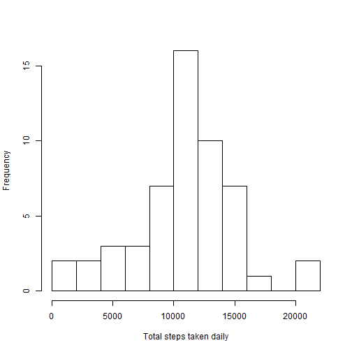
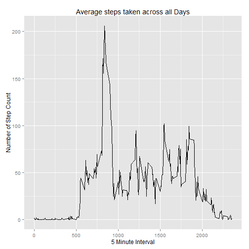
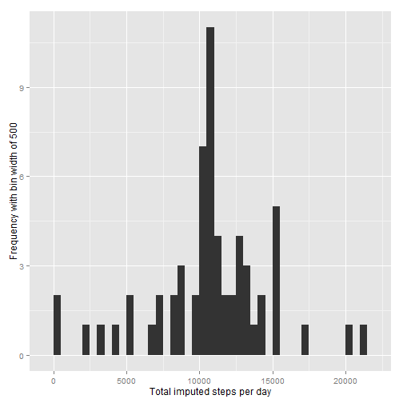
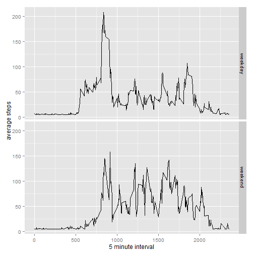

## Introduction
It is now possible to collect a large amount of data about personal movement using activity monitoring devices such as a Fitbit, Nike Fuelband, or Jawbone Up. These type of devices are part of the "quantified self" movement - a group of enthusiasts who take measurements about themselves regularly to improve their health, to find patterns in their behavior, or because they are tech geeks. But these data remain under-utilized both because the raw data are hard to obtain and there is a lack of statistical methods and software for processing and interpreting the data.

This assignment makes use of data from a personal activity monitoring device. This device collects data at 5 minute intervals through out the day. The data consists of two months of data from an anonymous individual collected during the months of October and November, 2012 and include the number of steps taken in 5 minute intervals each day.

## Load Data


```r
data <- read.table(unz("activity.zip", "activity.csv"), header=T, quote="\"", sep=",")
data$date <- as.Date(data$date) 
```

## Mean total number of steps taken per day
## 
* Create a new dataset ignoring missing data


```r
no_na <- na.omit(data) 
steps_d <- rowsum(no_na$steps, format(no_na$date, '%Y-%m-%d')) 
steps_d <- data.frame(steps_d) 
names(steps_d) <- ("steps") 
```

* Plot histogram of the total steps taken each day


```r
hist(steps_d$steps, 
     main=" ",
     breaks=10,
     xlab="Total steps taken daily") 
```

 

* Report mean and median steps taken


```r
 mean(steps_d$steps)
```

```
## [1] 10766.19
```


```r
 median(steps_d$steps) 
```

```
## [1] 10765
```

## Average daily activity pattern

* Calculate average steps for each of 5-minute interval during a 24-hour period


```r
library(plyr)
steps_avg_int <- ddply(no_na,~interval, summarise, mean=mean(steps))
```

* Time series of the 5-minute interval and the average number of steps taken


```r
library(ggplot2)
qplot(x=interval, y=mean, data = steps_avg_int,  geom = "line",
      xlab="5 Minute Interval",
      ylab="Number of Step Count",
      main="Average steps taken across all Days"
      )
```

 

* Report the 5-min interval averaged across all the days in the dataset that contains the maximum number of steps:


```r
steps_avg_int[which.max(steps_avg_int$mean), ]
```

```
##     interval     mean
## 104      835 206.1698
```

* Conclusion

### The person's daily activity peaks around 8:35 am

## Inputting missing values

* Calculate and report the total number of missing values in the dataset

```r
length(which(is.na(data$steps)))
```

```
## [1] 2304
```

* Devise a strategy for filling in all of the missing values in the dataset. The strategy does not need to be sophisticated. Used mean for that 5-minute interval, etc.


```r
# Use mean and impute library
library(Hmisc)
new_data <- data
new_data$steps <- impute(data$steps, fun=mean)
```

* Make a histogram of the total number of steps taken each day


```r
new_stepsByDay <- tapply(new_data$steps, new_data$date, sum)
qplot(new_stepsByDay, xlab='Total imputed steps per day', ylab='Frequency with bin width of 500', binwidth=500)
```

 

* Calculate and report the mean and median total number of steps taken per day


```r
mean(new_stepsByDay)
```

```
## [1] 10766.19
```

```r
median(new_stepsByDay)
```

```
## [1] 10766.19
```

#### Imputed values have modified the median (making it same as mean) but mean is the same as before. The method of imputing does not impact the estimate of the total number of daily steps.

## 

## Differences in activity patterns between weekdays and weekends

* Create a new factor variable in the dataset with two levels - "weekday" and "weekend" indicating whether a given date is a weekday or weekend day


```r
new_data$dateType <-  ifelse(as.POSIXlt(new_data$date)$wday %in% c(0,6), 'weekend', 'weekday')
```

* Make a panel plot containing a time series plot 


```r
avg_new_data <- aggregate(steps ~ interval + dateType, data=new_data, mean)
ggplot(avg_new_data, aes(interval, steps)) + geom_line() + facet_grid(dateType ~ .) + xlab("5 minute interval") +  ylab("average steps")
```

 
